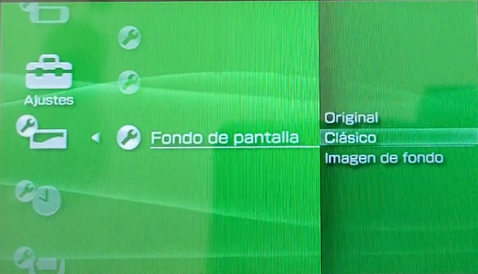

# PSP Portfolio

A personal portfolio project inspired by the PlayStation Portable (PSP) interface, built with Vue 3, Vite, Pinia, and Vue Router. This project showcases my skills in web development and UI/UX design, featuring a custom animated menu, keyboard navigation, and a retro gaming aesthetic.

## Features

- **PSP-inspired UI**: Custom SVG backgrounds and animated menu transitions.
- **Keyboard Navigation**: Navigate menus using arrow keys (←/A, →/D, ↑/W, ↓/S) and select with Spacebar.
- **Component-based Architecture**: Built with reusable Vue components.
- **State Management**: Uses Pinia for state handling.
- **Routing**: Vue Router for seamless navigation.
- **Custom Fonts & Icons**: Includes retro fonts and [Iconify](https://iconify.design/) icons.

## Demo



## Getting Started

### Recommended IDE Setup

- [VSCode](https://code.visualstudio.com/) + [Volar](https://marketplace.visualstudio.com/items?itemName=Vue.volar) (disable Vetur)

### Project Setup

```sh
npm install
```

### Compile and Hot-Reload for Development

```sh
npm run dev
```

### Compile and Minify for Production

```sh
npm run build
```

### Lint with [ESLint](https://eslint.org/)

```sh
npm run lint
```

## Folder Structure

```plaintext
├── public/
│   ├── images/         # Static images (PSP logo, screenshots, etc.)
│   └── audios/         # Sound effects for UI
├── src/
│   ├── assets/         # Fonts and static assets
│   ├── components/     # Vue components (menus, backgrounds, info)
│   ├── composables/    # Custom hooks (keyboard controls)
│   ├── constants/      # Menu item definitions
│   ├── router/         # Vue Router setup
│   ├── utils/          # Utility functions (audio)
│   └── views/          # Main view (PSPview.vue)
```

## License

This project is licensed under the MIT License. See [LICENCE.txt](LICENCE.txt) for details.

---
